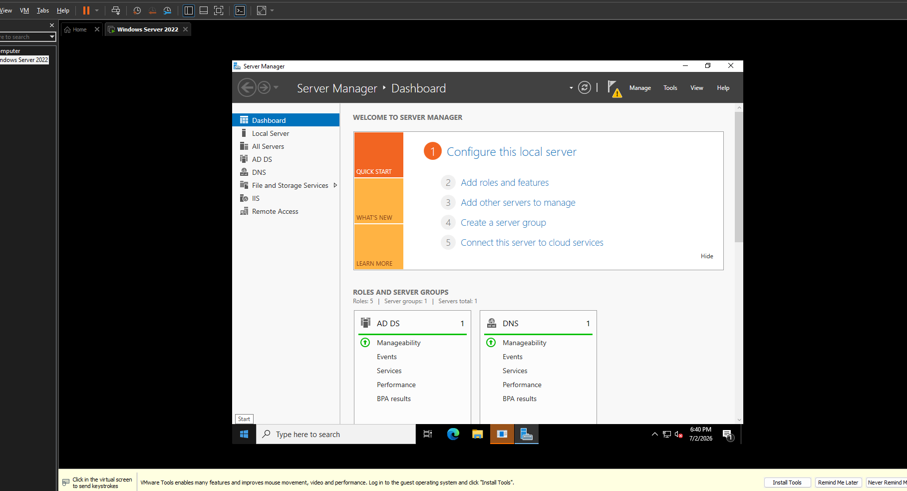
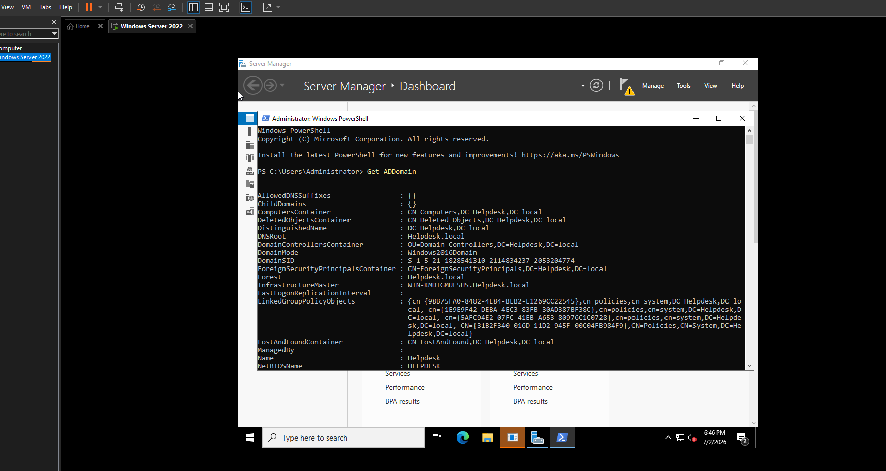
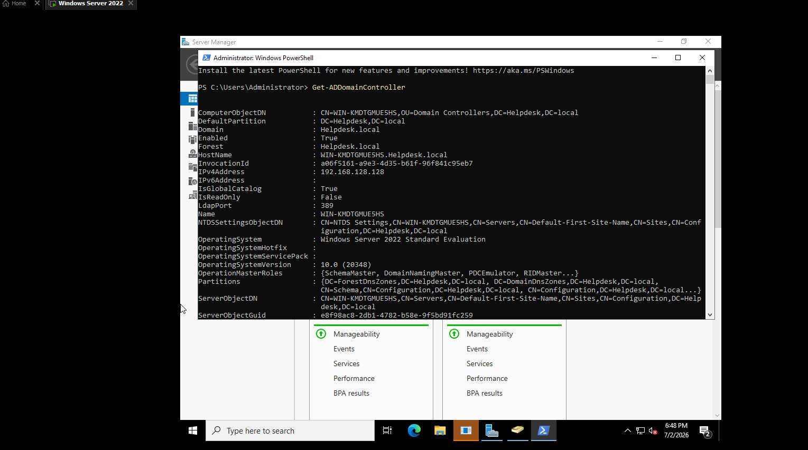
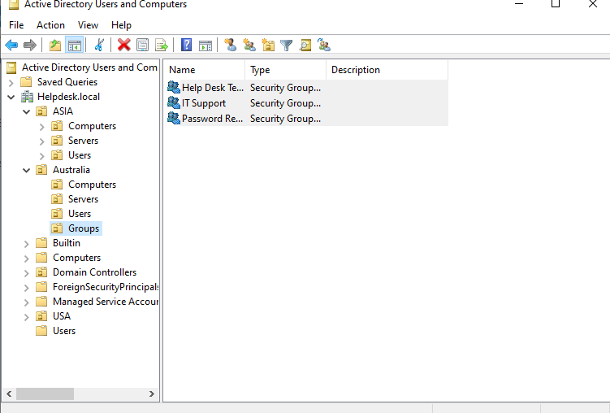
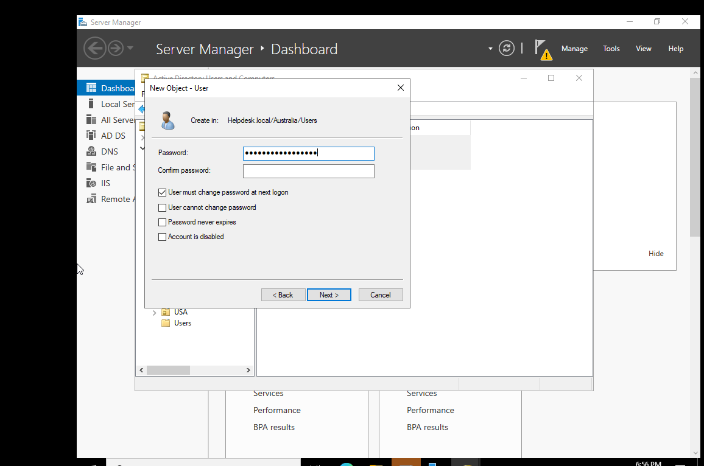
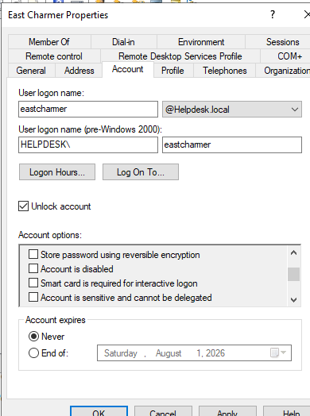

# Active Directory Windows Server Home Lab

## Project Overview

This project demonstrates basic Active Directory administration using Windows Server 2022. The lab includes Active Directory Domain Services, DNS, domain verification, security group creation, user group membership, and a help desk account unlock task.

I started documenting this lab after the domain was already promoted. The screenshots verify the completed setup using Server Manager, PowerShell, and Active Directory Users and Computers.

## Lab Environment

- VMware Workstation Pro
- Windows Server 2022
- Active Directory Domain Services
- DNS Server
- Active Directory Users and Computers
- PowerShell

## Task 1: Active Directory Domain Verification

In this task, I verified that the Windows Server was configured as an Active Directory Domain Controller.

Completed actions:

- Confirmed Active Directory Domain Services was installed
- Confirmed DNS Server role was installed
- Verified the Active Directory domain using PowerShell
- Verified the Domain Controller using PowerShell

### Screenshot 1: Server Manager Roles

### Screenshot 2: Domain Verification with PowerShell

### Screenshot 3: Domain Controller Verification with PowerShell

## Task 2: Security Group Creation

In this task, I created security groups in Active Directory Users and Computers.

Completed actions:

- Opened Active Directory Users and Computers
- Created a Groups Organizational Unit
- Created Global Security Groups
- Created IT Support group
- Created Help Desk Technicians group
- Created Password Reset Team group

### Screenshot 4: Security Groups Created

## Task 3: User Group Membership

In this task, I added users to the IT Support security group.

Completed actions:

- Opened IT Support group properties
- Added users to the group
- Verified group membership in Active Directory Users and Computers

### Screenshot 5: Users Added to IT Support Group

## Task 4: Account Unlock Help Desk Task

In this task, I practiced a common help desk Active Directory task by unlocking a user account.

Completed actions:

- Opened the user account properties
- Went to the Account tab
- Selected Unlock account
- Prepared the account for user access

### Screenshot 6: User Account Unlock

## Skills Demonstrated

- Windows Server administration
- Active Directory Domain Services
- DNS role verification
- Domain Controller verification
- PowerShell commands
- Active Directory Users and Computers
- Organizational Unit management
- Security group creation
- Group membership management
- User account unlock
- Basic help desk administration

## What I Learned

This project helped me understand how Active Directory is used in an IT support environment. I practiced verifying a domain, checking Domain Controller details, creating security groups, adding users to groups, and unlocking a user account.

## Future Improvements

- Create more sample users
- Practice password reset tasks
- Disable and enable user accounts
- Move disabled users to a Disabled Users OU
- Add a Windows 10 or Windows 11 client VM
- Join the client machine to the domain
- Configure and test Group Policy
- Create shared folders with NTFS permissions
